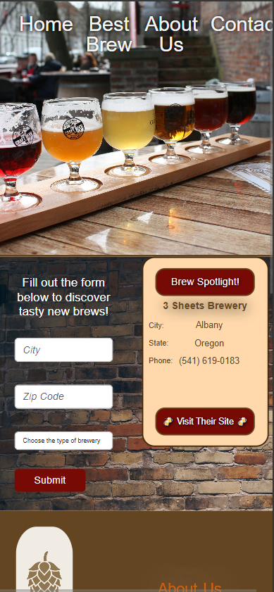

# Group Project: Brew Bound

## Overview Description
Welcome to Brew Bound!

We have created a web application that helps the Public and Breweries to find each other! We wanted to have a central hub that not only allows for brewereies to publish thier craft beers and ciders, it allows for locals and new patrions to connect and find new breweries to explore!

Please take a look at our prototype at the bottom of this README and all feedback is welcome!

Cheers! 🍻

## Group Project - Acceptance Criteria

 - As a group, you will decide on an MVP (Minimal Viable Product) and clear it with the instructors before starting. 

- The application uses semantically correct HTML and has at minimum 2 HTML pages.

- The application needs to use a type of CSS Framework, otherwise if a Framework is not selected, the application requires custom CSS.

- The applicaiton needs to use JaveScript for various logic perameters.

   - Must have at least 1 From

- The application must use LocalSorage for some data.

- The applicaiton must use at least one API database. 

- The application must use one new technology or library.

- All code presented must be clean and well organized.

- There must not be any obvious bugs or errors in the Dev Console.

- All group members must have frequent commits to the project. 

- The README must be well organized:
   - Project description
   - Team Member List
   - Screen Shots &/or Gifs of the Deployed Pages
   - Link to deployed version on Github Pages

## Media Attachments

Below is a screen shot of the Home Page (Desktop & Mobile), Results Page, & Gallery.

The Results Page.

The Gallery Page.

The Company Logo.

The Presentation.

## Our Company: Syntaxic Suga Co.
- Tyler Walter 
- Maggie McDowell
- Reynolds Addy
- Kee Thao
- Brittany Junclaus

## Acknowledgements & Technology Stacks
- CSS
   - Custom CSS
   - Bootstrap

 

- JavaScript
   - Parsleyjs
   - baguetteBox.js
   - JQuery

 

- APIs
   - Open Brewery DB

 

- Misc Software
   - Figma
   - Windows Mark Up
   - Excalidraw.com
   - Colors.co
   - Unsplash.com 

 

- Presentation Material
   - Template: Slidesgo
   - Icons: Flaticon
   - Infografics & Images: Freepik

## Deployed Application:
[Click Here](https://github.com/TyWalter/brew-bound) to view the Repository for this project.

[Click Here](https://tywalter.github.io/brew-bound/) to view the deployed version of the web application. 

